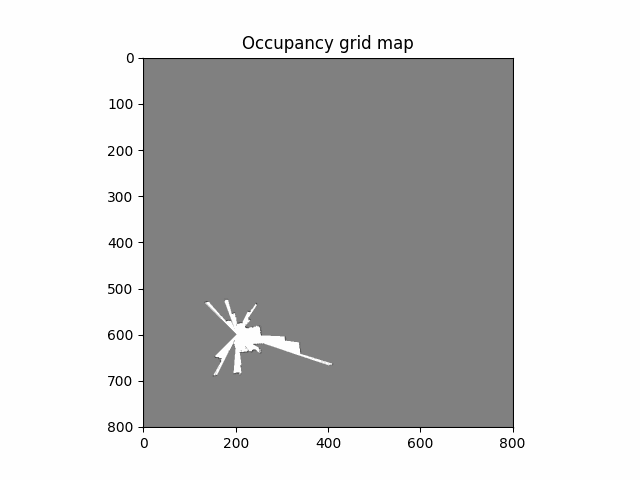

# ECE276A - Project 2: Particle Filter SLAM

Author: Yang Jiao

Date: March 7, 2023

Local Python environment:

* Python version: 3.10.9
* Libraries: numpy, matplotlib, opencv-python

## Mapping results

| 5 Particles                                       | 100 Particles                                           |
| ------------------------------------------------- | ------------------------------------------------------- |
|  |  |

Note that the animation speed does not reflect the program executing speed. The program runs significantly slower with 100 particles than with 5 particles.

## Project Hierachy

The submitted `.zip` contains all of files in the `code` folder. `main.py` is the entrance for executing the project. It invokes class methods from `models.py` file which are the implementation for particle filter SLAM and texture mapping. The file `sensors.py` is modified based on the given `load_data.py` file and the RGBD image conversion code snippet from piazza. Both `sensors.py` and `models.py` invoke provided functions from `pr2_utils.py` file.

```
-----code
|    |-- readme.md
|    |-- main.py
|    |-- sensors.py (Load data from data folder)
|    |-- models.py (SLAM and texture mapping implementations)
|    |-- pr2_utils.py (provided code)
|
|----data
     |-- dataRGBD (folder with all RGBD images)
        |-- Disparity20
        |-- Disparity21
        |-- RGB20
        |-- RGB21
     |-- Encoders20.npz
     |-- Encoders21.npz
     |-- Hokuyo20.npz
     |-- Hokuyo21.npz
     |-- Imu20.npz
     |-- Imu21.npz
     |-- Generated SLAM and texture mapping results will also appear here
```

## Executing the Code

Below are the instruction to execute this project.

1. Extract the `.zip` file and copy all `.py` files to the `code` folder in a same structure of project workspace as shown in **Project Hierachy** section;
2. Open the **root folder** (containing both `code` and `data`) in a Python IDE or cd to the root folder in terminal;
3. Run `main.py` file in the IDE or use terminal command such as `python ./code/main.py`.
   * One can (remove) comments on specific codes in the `main.py` file to execute different tasks;
   * One can test on different dataset by passing different arguments to initialize the Robot() class instance;
   * To modify the noise variance, need to go to the `models.py` file and modify the `initParticles(self, N)` method in the  `Robot()` class;
4. The meaning of different **mode** is stated at the beginning of the `__init__()` method for the `Robot()` class, which is also pasted here:
   ```
   # mode:
   # 0 - dead reckoning
   # 1 - prediction only
   # 2 - particle filter
   # 3 - texture mapping
   ```
